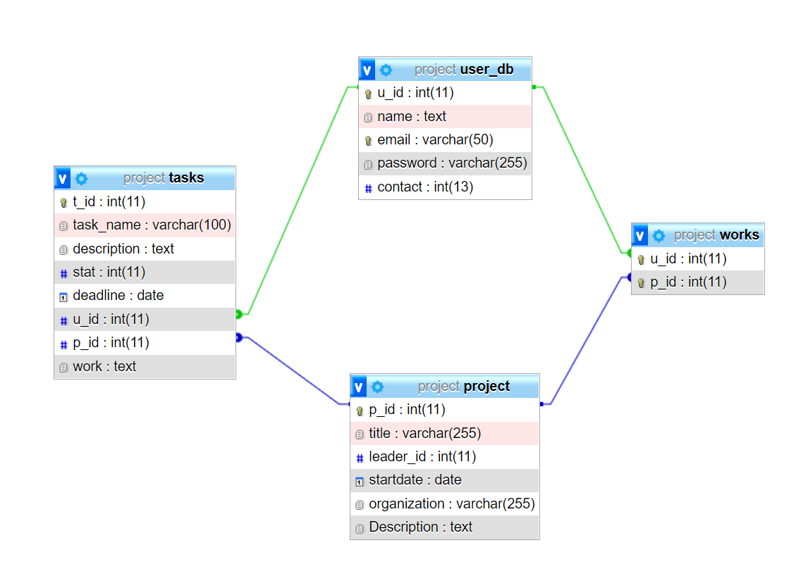

# SE-Project-Group24
[](https://doi.org/10.5281/zenodo.7155361)

[](https://github.com/devanshi39/SE-Project-Group24-Evolo-Project_Management_System/issues)
[](https://github.com/devanshi39/SE-Project-Group24-Evolo-Project_Management_System/stargazers)
[](https://github.com/devanshi39/SE-Project-Group24-Evolo-Project_Management_System/network)


[](https://codecov.io/gh/devanshi39/SE-Project-Group24-Evolo-Project_Management_System/branch/main)


## What is Evolo?
Evolo is Dashboard based Project Management System. A complete solution for group projects in organizations that lets you track your work in any scenario. Working in a team is a cumbersome task, ease it using our project management system. Add statuses, comments, and attachments to make sure you have all the correct information to get your work done!
Manage your team on this one platform having variety of features:
 - Assign them tasks on this platform, with a deadline.
 - Add or Remove team members in the middle of the project, conflict free from redundant or missing tasks.
 - All the members will be reminded about the deadline periodically, even requests can be made to team leader for deadline extension.
 - Team members can submit their task using this platform too.
 - Submitted tasks can be checked and reviews can be directly conveyed to the team members using this platform.

Evolo users can be divided into two types:
 - Project administrators: 
 Project administrators are responsible for configuring their projects. They can administer projects, change the look and feel, and make various configuration changes to the project.

 - Users:
 Users are responsible for working in specific JIRA Core projects. Users are given access to a project's issues and, depending on their permissions, work on the issue by commenting on it, transitioning it through its workflow and closing it when complete.


## Tools and Technology Used
### Tools:
1. MAMP: 
MAMP is a free and open source software used to develop and run dynamic websites. MAMP is a one-click-solution for setting up your personal web server. MAMP installs a local server environment in a matter of seconds on your computer. It is used to run Apache and MySQL servers.
- Apache server
- MySQL server
- phpMyAdmin

2. Codecov
    
### Technology:
1. HTML
2. CSS Bootstrap 3
3. Javascript
4. PHP
5. mySQL

## Getting Started 
#### 1. Install MAMP

 - MAMP installs a local server environment in a matter of seconds on your Windows or macOS computer. MAMP comes free of charge, and is easily installed.
 - Download [MAMP](https://www.mamp.info/en/downloads/)

#### 2. Clone this [repo](https://github.com/devanshi39/SE-Project-Group24-Evolo-Project_Management_System)

#### 3. Move the repo to htdocs location

 - We can either change the path for running the project or we can move the files to htdocs folder
 - The path location of htdocs folder would be something like this ```C:\MAMP\htdocs\```
 - Move all the files of the repo to the above location

#### 4. Start the server and uploading the database

 - Start MAMP application and click on start the servers, which will start the Apache and MySQL servers. Then click on Open WebStart page.
 - Click on tools dropdown and click on ```PHPMYADMIN```
 - Now you'll see the MySQL db server, you can create a database with name ```project```
 - Import [project.sql]() file in the import section after selecting the ```project``` db.
 - Open MAMP again and click on Open WebStart page.
 - Change the url of the webpage to ```http://localhost/index.php```
 - You are all set!
 
 For more information on how the project works, you can see the video demonstration below.

## Video Demonstration

[video](https://drive.google.com/file/d/1vSyY5syCLUy7-SfEV9BFUOmdo7E_J8Ec/view?usp=sharing)

## Project Documentation

You can view the descriptive project documentation [here](https://evolodocs.web.app/)

## Database Schema



## Directory Structure
    |   .github/hooks
        |   README.md
        |   post-commit
        |   pre-commit
    |   code
        |   css
            |   bootstrap.css
            |   dash_style.css
            |   styles.css
        |   images
            |   contact-background.jpg
            |   customer-logo-1.png
            |   customer-logo-2.png
            |   customer-logo-3.png
            |   customer-logo-4.png
            |   customer-logo-5.png
            |   customer-logo-6.png
            |   details-1-office-worker.svg
            |   details-2-office-team-work.svg
            |   details-lightbox-1.svg
            |   details-lightbox-2.svg
            |   down-arrow.png
            |   ex-header-background.jpg
            |   favicon.png
            |   header-background.jpg
            |   header-teamwork.svg
            |   logo.svg
            |   services-icon-1.svg
            |   services-icon-2.svg
            |   services-icon-3.svg
            |   statement-icon-1.svg
            |   team-member-1.svg
            |   team-member-2.svg
            |   team-member-3.svg
            |   team-member-4.svg
            |   testimonial-1.svg
            |   testimonial-2.svg
            |   testimonial-3.svg
            |   testimonials-2-men-talking.svg
            |   testimonials-background.jpg
            |   up-arrow.png
            |   video-frame.svg
        |   js
            |   bootstrap.min.js
            |   jquery.min.js
            |   scripts.js
        |   add_member.php
        |   add_work.php
        |   assign_task.php
        |   dashboard.php
        |   delete_task.php
        |   index.php
        |   login.php
        |   logout.php
        |   pdo.php
        |   registration.php
        |   remove_member.php
        |   signup.php
        |   validation.php
        |   verify_work.php
    |   .gitignore
    |   CITATION.cff
    |   CODE-OF-CONDUCT.md
    |   CONTRIBUTING.md
    |   LICENSE
    |   README.md
    |   phpunit.xml

## Contributors
1. [Devanshi Savla](https://github.com/devanshi39)
2. [Indranil Banerjee](https://github.com/indranil1)
3. [Aditya Srivastava](https://github.com/adityasvat)
4. [Soha Bhatia](https://github.com/Sohabhatia)
5. [Akruti Sinha](https://github.com/Akruti25)

To find out how you can contribute to this project, read the [CONTRIBUTING.md](https://github.com/devanshi39/SE-Project-Group24-Evolo-Project_Management_System/blob/main/CONTRIBUTING.md) file

The discord chat channel link is included in the file [CONTRIBUTING.md](https://github.com/devanshi39/SE-Project-Group24-Evolo-Project_Management_System/blob/main/CONTRIBUTING.md)
